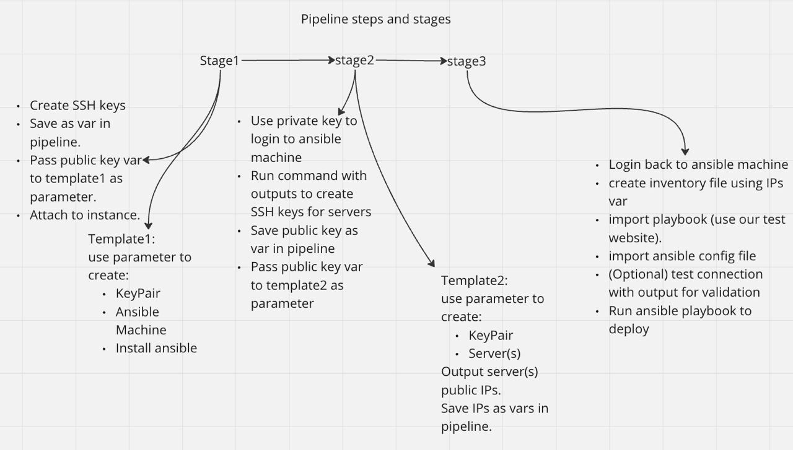

# actions_cloudformation_ansible
Attempt to automate entire deployment process of webservers using GitHub actions x AWS CloudFormation x Ansible to an AWS environment.

Following our principle at **notOnPrem** to power our learning with automation. We select suitably interesting and random projects to automate.

This project is a fork/spin-off of this wonderful tutorial by [AOS Notes](https://www.aosnote.com/) on [Youtube](https://www.youtube.com/watch?v=Z6YGH0HVejE&list=LL&index=1&t=1535s&ab_channel=AOSNote)

Some of the deployment resources in this repository have been extracted from the AOS project [notes](https://github.com/azeezsalu/ansible-project-commands) and modified for simplicity.

Extracted resources:
1. play_book.yml
2. manual_steps.txt

## Pipeline Design

Pseudo pipeline design for GitHub Actions implementation
